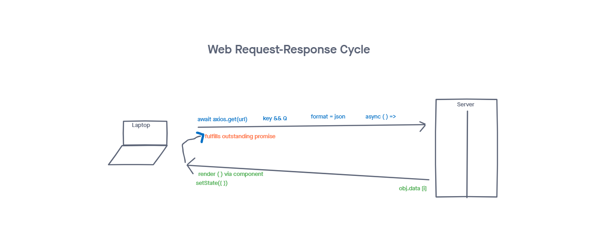
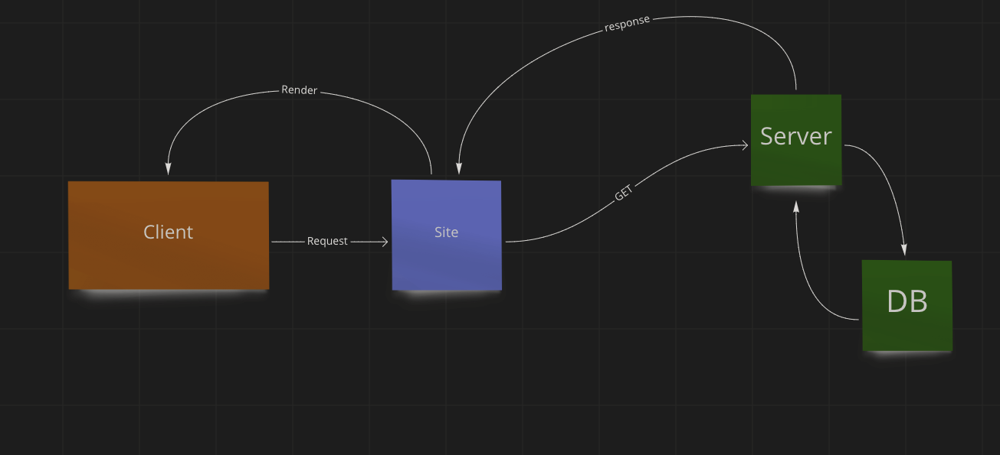
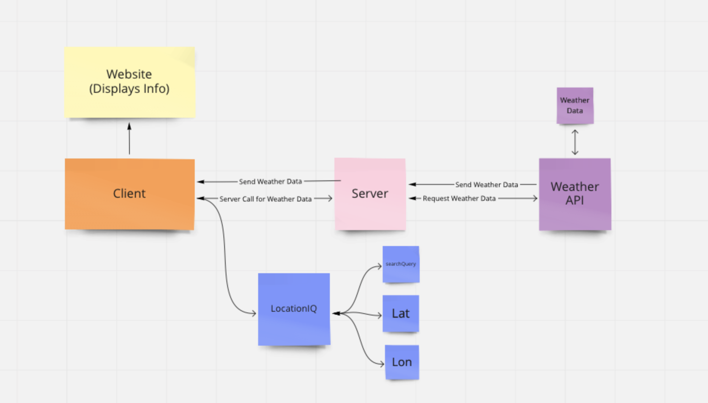
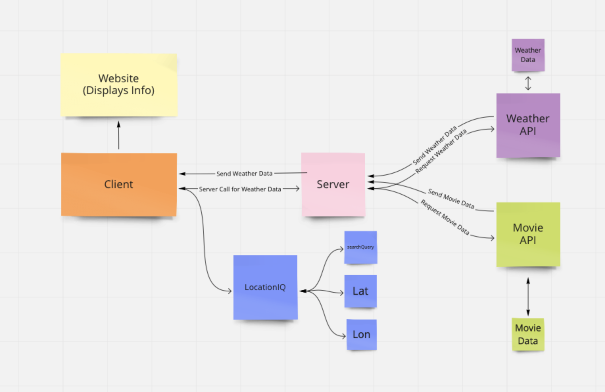

# City Explorer API

**Author**: Jacob Gregor
**Version**: 1.0.1

## Overview

BAck-End server handling the Weather API & Movie DataBase API for City-Explorer.

## Getting Started

Checkout the Deployed site Below!
https://city-explorer-jacob-gregor.netlify.app

Checkout all the planning and mapping that went into this project below!
https://trello.com/b/sgLCbZkt/city-explorer

## Architecture

This Utilized the following Tech:
-> Node.js
-> express
-> nodemon
-> Javascript

## Change Log

<!-- Use this area to document the iterative changes made to your application as each feature is successfully implemented. Use time stamps. Here's an example:

09-22-21 11:45pm - Application now has a fully-functional express server, with a GET route for the location resource. -->

## Credit and Collaborations

Bryce Pfingston -> Code Reviews/Error debugging
Anthony Morton -> Code Reviews/Error debugging
Jonathan Brock -> Code Reviews/Error debugging

Mapping out:

## LAB-07

Name of feature: Create Repo

Estimate of time needed to complete: 30

Start time: 6:20

Finish time: 6:50

Actual time needed to complete: 30 minutes.

---

Name of feature: Sever setup (09.22.21)

Estimate of time needed to complete: 1 hour

Start time: 7:00pm

Finish time: 11pm

Actual time needed to complete:

---

Name of feature: Weather Posting

Estimate of time needed to complete: 4

Start time: 4

Finish time: 8

Actual time needed to complete: a little over 4 hours.

## LAB-08

Name of feature: Weather (live)

Estimate of time needed to complete:

Start time:

Finish time:

Actual time needed to complete:

---

Name of feature: Movies

Estimate of time needed to complete:

Start time:

Finish time:

Actual time needed to complete:

---

Name of feature: Publish

Estimate of time needed to complete: 1 Hour

Start time: 11pm

Finish time: 11:45

Actual time needed to complete: 45 minutes.
